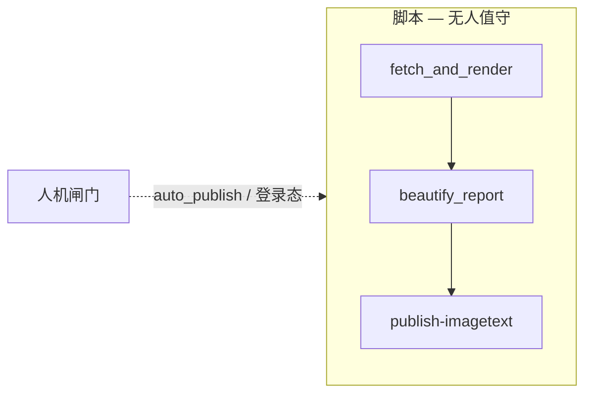

# CFFEX 流水线 × Agent 搭建图对照

把「AI Agent 搭建流程图」落到本仓库的 `cffex-daily`：哪些步骤继续用脚本，哪些才值得主/子 Agent。

相关实现：[`modules/cffex-daily/`](../modules/cffex-daily/) · 手册：[cffex-daily-video.md](cffex-daily-video.md) · Skill：`.cursor/skills/cffex-daily-video/`

---

## 总原则

| 判断 | 结论 |
|------|------|
| 步骤输入/输出稳定、可验收、已有 CLI | **脚本**（`run.sh` / `npm run cffex:*`） |
| 需要拆任务、跨模块改代码、排障、改 prompt/样式 | **主 Agent 路由 + 子 Agent 执行 + 你审计** |
| 发抖音、改定时开关、动密钥 | **人机协同**（必须人工确认） |

日常生产路径默认 **不依赖 Cursor Agent**：

```text
LaunchAgent 21:00 → run.sh
  → fetch_and_render.py
  → beautify_report.py（gpt-image-2）
  → publish-imagetext-to-douyin.mjs
```

Agent 用在：**改流水线本身**、**手动调试美化**、**故障排查**，而不是替代每晚定时。

---

## 对照表（流程图节点 → cffex）

| 流程图节点 | 在 cffex 里是什么 | 谁来做 | 说明 |
|------------|-------------------|--------|------|
| ① 场景定义与可行性 | 「交易日净持仓 → 竖屏图文 → 抖音」已成立 | — | 已通过可行性；固定日报继续走脚本 |
| 是否合适？→ 否 | 用规则/SQL | 脚本 | 抓数、周末 skip、路径拼接都是规则，不是 Agent |
| ② 框架与模型 | OpenAI Images + Playwright + Remotion + Cursor（调试） | 选型已定 | 定时美化用 API；手动美化可用 Cursor GenerateImage |
| ③ 角色 + 提示词 | Skill / `beautify-prompt.md` / 派单 brief | **主 Agent** 维护；子 Agent 执行改稿 | 改文案风格、Infographic 提示词时用 Agent |
| ③ 规划能力 | 任务图：生成 → 美化 → 发布；改代码时拆 shared / biz | **主 Agent** | 生产调度由 `run.sh`；开发调度由主 Agent |
| ③ 记忆系统 | `work/output/`、`work/logs/`、抖音 profile、config.json | 文件系统 | 不另建 Agent 记忆层 |
| ③ 工具集成 | `cffex:*` npm、Pillow、Playwright、Chrome | 脚本 + Agent 调 CLI | Agent 应调现有命令，不重写抓数 |
| ④ 是否多智能体？ | 改代码跨模块时 = 是；只跑日报 = 否 | 见下表 | — |
| 路由 + 执行 + 审计 | 主 Agent 派单 → 子 Agent 改目录 → 人审 diff | **MAS** | 见「开发态」 |
| 单体 Agent 编排 | 单日手动跑通、只读排障 | **单 Agent** | `@cffex-daily-video` Skill 六步即可 |
| 人机协同 | `cffex:auth`、真实发布、`auto-off/on`、装/卸定时 | **人确认** | Agent 可准备命令，不擅自上线发帖 |
| 开发与部署 | 改 `modules/cffex-daily` / `shared/douyin`；LaunchAgent | 脚本部署 + Agent 改码 | 定时安装仅用户明确要求时 |
| 测试与评估 | 看 PNG/JSON、日志、dry-run 美化、发布前预览 | 脚本验收 + 人眼 | 不通过 → 改 beautify prompt / 修发布脚本 |
| 可观测性 | `work/logs/daily-*.log`、`cffex:schedule-status` | 脚本 | Tracing 即日志 + 产物路径 |
| 持续治理 / 成本 | `auto_publish`、API 用量、风格参考图 | 人 + 配置 | 失败回灌到 prompt / config，不是再堆 Agent |

---

## 运行态（每晚 / `cffex:pipeline`）：几乎全脚本



| 步骤 | 命令 / 文件 | Agent？ |
|------|-------------|---------|
| 开关检查 | `config.json` → `schedule.auto_publish` | 否 |
| 抓数 + 底图 + JSON + MP4 | `fetch_and_render.py` / `cffex:daily` | 否 |
| 周末 / 无数据 skip | `run.sh` 判断 | 否 |
| 美化 | `beautify_report.py` / `cffex:beautify` | 否（定时）；手动调试可用 Agent 出图 |
| 图文发布 | `publish-imagetext-to-douyin.mjs` | 否（定时）；首次登录 / 失败修复要人 |
| 视频发布（可选） | `cffex:publish` | 默认否；建议人确认 |

**结论（对应图中「是否合适」）**：生产日报是确定性流水线 → **规则脚本优先**，不要用多 Agent 每晚「协作发帖」。

---

## 开发态（改流水线 / 修 bug）：主 Agent + 子 Agent

仅当目标是**改代码或深度排障**时启用 MAS（路由 + 执行 + 审计）。

| 角色 | 范围 | 典型任务 |
|------|------|----------|
| **主 Agent（路由）** | 全仓只读 + 派单 | 拆任务、定依赖、合并顺序、汇总验收 |
| **子 Agent A（执行）** | 仅 `modules/shared/douyin/**` | 登录/上传/发布能力 |
| **子 Agent B（执行）** | 仅 `modules/cffex-daily/**` | 接线、config、`run.sh`、beautify、文案元数据 |
| **子 Agent C（执行，可选）** | 仅 `.cursor/skills/cffex-daily-video/**` 或 `docs/` | 更新 Skill / 手册，与实现同步 |
| **你（审计）** | PR / diff / 真机发布 | 确认边界、跑命令、敏感操作放行 |

依赖顺序：**A（shared）定接口 → B（biz）接线 → C（文档）**；路径必须互不重叠。

### 主 Agent 一句话目标示例

```text
目标：修 CFFEX 图文发布失败 / 或给日报增加某字段展示。
约束：抖音能力只改 modules/shared/douyin；业务只改 modules/cffex-daily；
禁止业务互相 import；发布与装定时需我确认。
请按「路由+执行+审计」拆子任务并派 brief。
```

### 验收命令（审计清单）

```bash
npm run cffex:daily -- --date YYYYMMDD
npm run cffex:beautify -- --date YYYYMMDD --dry-run   # 先看提示词/路径
npm run cffex:beautify -- --date YYYYMMDD
# 发布前人工确认后再：
npm run cffex:publish-imagetext -- --date YYYYMMDD --image <美化png> --skip-music
npm run cffex:schedule-status
```

---

## 手动调试美化：单体 Agent 即可

对应图中「单体 Agent 编排」+ Skill 六步：

1. 依赖 / 登录（人确认 `cffex:auth`）
2. `cffex:daily`
3. 校验 PNG/JSON
4. `cffex:beautify` **或** Cursor GenerateImage（Infographic）
5. `cffex:publish-imagetext`（人确认）
6. 回报路径与结果

此时不必拆多子 Agent，除非同时要改 shared 发布实现。

---

## 反馈迭代怎么接回图中的环

| 失败现象 | 回到哪一能力 | 动作 |
|----------|--------------|------|
| 数据错 / 无图 | 工具 / 规则脚本 | 修 `fetch_and_render.py`，仍用脚本 |
| 美化难看 / API 失败 | 角色+提示词、工具 | 改 `beautify-prompt` / key / 风格参考；可派子 Agent 只改 beautify |
| 发布失败 | 工具 + 人机 | `cffex:auth`；必要时子 Agent 只动 `shared/douyin` |
| 定时没跑 | 可观测性 | `cffex:schedule-status`、查 log；装定时需人确认 |
| 成本过高 | 持续治理 | 调美化频率、`auto-off`、复用参考图 |

---

## 速查：什么时候开 Agent

| 你想做的事 | 推荐 |
|------------|------|
| 今晚照常发日报 | 脚本 / 定时，不开 Agent |
| 指定日期补跑 | `cffex:pipeline -- --date …` |
| 调一张图的版式/风格 | 单体 Agent 或 `cffex:beautify` |
| 修抖音上传 + 改日报接线 | **主 Agent + 子 A/B** |
| 停开发布 | 人执行 `cffex:auto-off`（Agent 可提醒，不自作主张） |
