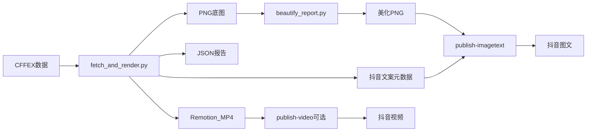

# CFFEX 中信期货净持仓日报 — 完整手册

从中金所（CFFEX）抓取中信期货持仓数据，生成 720×1280 竖屏底图与 Remotion 动画视频；默认经 **Infographic Engine / gpt-image-2** 美化为图文，发布到抖音创作者中心。支持 **每晚 21:00** LaunchAgent 无人值守全链路（生成 → 美化 → 图文发布）。

- **仓库路径**：`modules/cffex-daily/`
- **Agent Skill**：`.cursor/skills/cffex-daily-video/`
- **本地文档副本**：`docs/cffex-daily-video.md`
- **脚本 vs Agent 对照**：[cffex-agent-orchestration.md](cffex-agent-orchestration.md)

---

## 1. 流程概览



| 阶段 | 工具 | 产物 |
|------|------|------|
| 抓数 + 底图 | `fetch_and_render.py` | PNG / JSON / 抖音元数据 |
| 视频（可选） | Remotion | MP4（约 7.5s，含 BGM） |
| 美化 | `beautify_report.py` + OpenAI `gpt-image-2` | `*-auto-vN.png` |
| 图文发布（默认） | `publish-imagetext` | 抖音图文作品 |
| 视频发布（可选） | `cffex:publish` | 抖音视频作品 |
| 定时 | LaunchAgent 21:00 → `run.sh` | 日志 + 自动发布 |

**身份约定**

| 场景 | 美化方式 |
|------|----------|
| 定时 / `cffex:pipeline` | OpenAI Images API（`OPENAI_API_KEY`），不依赖 Cursor |
| 手动调试 | 可用 Cursor GenerateImage + `gpt-image-2-style-library` |

---

## 2. 环境准备

### 系统要求

- macOS（LaunchAgent）
- Python 3.10+
- Node.js 18+
- Google Chrome
- `OPENAI_API_KEY`（美化必需）

### 首次安装

```bash
# 项目根目录
pip3 install Pillow playwright
cd modules/cffex-daily/remotion && npm install && cd -
npm run cffex:setup-douyin
npm run cffex:auth   # 手机抖音扫码，登录态写入 ~/.douyin-playwright/profile
```

建议将 `OPENAI_API_KEY` 写入 `~/.codex/.env`（`run.sh` 会自动 source）或 shell 环境。

---

## 3. 日常命令

| 命令 | 说明 |
|------|------|
| `npm run cffex:daily` | 抓数 + PNG + JSON + MP4 + 抖音元数据 |
| `npm run cffex:daily -- --date YYYYMMDD` | 指定交易日 |
| `npm run cffex:daily -- --force` | 周末强制生成 |
| `npm run cffex:beautify -- --date YYYYMMDD` | gpt-image-2 美化 |
| `npm run cffex:beautify -- --date YYYYMMDD --dry-run` | 只打印提示词与路径 |
| `npm run cffex:publish-imagetext -- --date YYYYMMDD --image <png>` | 发布美化图文 |
| `npm run cffex:pipeline` | **全链路**（与定时相同）：生成 → 美化 → 图文 |
| `npm run cffex:publish -- --date YYYYMMDD` | 发布视频（可选） |
| `npm run cffex:auth` | 重新扫码登录抖音 |
| `npm run cffex:schedule` | 安装每晚 21:00 定时 |
| `npm run cffex:unschedule` | 卸载定时 |
| `npm run cffex:auto-off` / `cffex:auto-on` | 停止 / 恢复自动发送 |
| `npm run cffex:schedule-status` | 查看 LaunchAgent 与开关 |

### 推荐手动路径（图文）

```bash
npm run cffex:daily -- --date 20260714
npm run cffex:beautify -- --date 20260714
npm run cffex:publish-imagetext -- \
  --date 20260714 \
  --image _hot-topic-infographic/beautified/cffex-position-report-2026-07-14-auto-v1.png \
  --skip-music
```

或一键：

```bash
npm run cffex:pipeline
```

---

## 4. 定时任务（21:00 美化图文）

每天 **21:00**（日历日触发）串行：

1. 若 `schedule.auto_publish=false` → 记日志后退出  
2. `fetch_and_render.py`（周末 / 无数据 → 无 PNG → **不发布**）  
3. `beautify_report.py`（需 API Key + 风格参考图）  
4. **美化成功后** `publish-imagetext-to-douyin.mjs`

```bash
npm run cffex:schedule          # 安装
npm run cffex:unschedule        # 卸载
npm run cffex:auto-off          # 停止自动发送（保留任务）
npm run cffex:auto-on           # 恢复
npm run cffex:schedule-status
```

| 项 | 路径 / 说明 |
|------|-------------|
| Plist 源 | `modules/cffex-daily/com.yuque.cffex-daily.plist` |
| 安装位置 | `~/Library/LaunchAgents/com.yuque.cffex-daily.plist` |
| 入口 | `modules/cffex-daily/run.sh` |
| 日志 | `modules/cffex-daily/work/logs/daily-YYYYMMDD.log` |

**前置**：21:00 机器开机且已登录 GUI；抖音登录态有效；Chrome 可用；`OPENAI_API_KEY` 可被 launchd 读到。

---

## 5. 产物路径

### 底图 / 视频 / 元数据

`modules/cffex-daily/work/output/`

| 文件 | 说明 |
|------|------|
| `citic-net-positions-YYYYMMDD.png` | 720×1280 底图 |
| `citic-net-positions-YYYYMMDD.json` | 报告数据 |
| `citic-net-positions-YYYYMMDD.mp4` | 竖屏视频 |
| `citic-net-positions-YYYYMMDD-douyin.json` | 视频/文案元数据 |
| `citic-net-positions-YYYYMMDD-imagetext.json` | 图文发布配置（发布时生成） |
| `douyin-video.json` | 最新视频配置快捷入口 |

### 美化图

`_hot-topic-infographic/beautified/`

| 命名 | 说明 |
|------|------|
| `cffex-position-report-YYYY-MM-DD-auto-vN.png` | CLI / 定时美化 |
| `cffex-position-report-YYYY-MM-DD-cursor-vN.png` | Cursor 手动美化 |

风格参考默认指向既有精修图（见配置 `beautify.style_reference`）。

---

## 6. 配置

主文件：`modules/cffex-daily/config.json`

```json
{
  "output_dir": "modules/cffex-daily/work/output",
  "logo_handle": "@小水獭学AI",
  "bgm": { "file": "modules/cffex-daily/bgm.mp3", "volume": 0.14, "enabled": true },
  "douyin": { "tags": ["期货", "股指期货", "中信期货", "持仓数据", "金融"] },
  "schedule": { "hour": 21, "minute": 0, "auto_publish": true },
  "beautify": {
    "enabled": true,
    "model": "gpt-image-2",
    "size": "1024x1536",
    "quality": "high",
    "style_reference": "_hot-topic-infographic/beautified/cffex-position-report-2026-07-14-cursor-v1.png",
    "output_dir": "_hot-topic-infographic/beautified",
    "image_gen_cli": "~/.codex/skills/.system/imagegen/scripts/image_gen.py"
  }
}
```

| 字段 | 说明 |
|------|------|
| `schedule.auto_publish` | `false` 时定时不生成/不美化/不发布 |
| `beautify.style_reference` | Infographic 风格参考图（必须存在） |
| `beautify.image_gen_cli` | OpenAI 图像 CLI 路径 |
| `douyin.tags` | 话题，最多 5 个、不带 `#` |

其他资源：`bgm.mp3`、`logo.png`、`encouragement_quotes.json`。

---

## 7. 数据与 JSON

### 报告 JSON

```json
{
  "trade_date": "20260714",
  "date_label": "2026年07月14日 周二",
  "daily_quote": "市场奖励有耐心、有纪律的人！",
  "logo_handle": "@小水獭学AI",
  "citic_by_symbol": { "IH": -1149, "IF": 463, "IC": 105, "IM": -245 },
  "citic_total": -826,
  "top20_net_short_total": 146910,
  "net_buy_total": -939,
  "bgm_enabled": true,
  "bgm_volume": 0.14
}
```

数据源：CFFEX 持仓排名（IH / IF / IC / IM）。

### 图文 JSON

```json
{
  "imagePaths": ["/abs/path/to/beautified.png"],
  "title": "20260714中信期货净持仓",
  "description": "…",
  "tags": ["期货", "股指期货", "中信期货", "持仓数据", "金融"]
}
```

可由 `publish-imagetext-to-douyin.mjs --date --image` 从当日 `*-douyin.json` 自动生成。

---

## 8. 抖音发布说明

### 图文（默认）

- 脚本：`modules/shared/douyin/publish-imagetext.mjs`
- 入口：`npm run cffex:publish-imagetext`
- 上传页：`…/upload?default-tab=3`
- **必须点页脚「发布」**，不要点「高清发布」（会中断编辑流）

### 视频（可选）

- 脚本：`modules/shared/douyin/publish-video.mjs`
- 入口：`npm run cffex:publish`（默认 `--skip-music`）
- 自动：上传 → 标题描述 → AI 封面 →「内容由 AI 生成」→ 发布

登录态：`~/.douyin-playwright/profile`（勿提交 git）。

---

## 9. Remotion 视频

| 项 | 值 |
|------|------|
| Composition | `CiticReportVideo` |
| 尺寸 | 720×1280 @30fps |
| 帧数 | 225（约 7.5s） |

```bash
npm run cffex:video -- \
  --json modules/cffex-daily/work/output/citic-net-positions-YYYYMMDD.json \
  --output modules/cffex-daily/work/output/citic-net-positions-YYYYMMDD.mp4
cd modules/cffex-daily/remotion && npm run preview
```

源码：`modules/cffex-daily/remotion/src/`（`CiticReportVideo.tsx`、`AnimatedBarChart.tsx` 等）。

日报底图按抖音小屏可读性设计（5 档字号 26 / 28–30 / 16 / 12 / 10px）。

---

## 10. 目录结构

```
modules/cffex-daily/
├── fetch_and_render.py
├── beautify_report.py
├── render_video.mjs
├── publish-to-douyin.mjs
├── publish-imagetext-to-douyin.mjs
├── run.sh / install-scheduler.sh / uninstall-scheduler.sh
├── set_auto_publish.py / schedule-status.sh
├── config.json
├── bgm.mp3 / logo.png / encouragement_quotes.json
├── remotion/
└── work/output/  work/logs/

modules/shared/douyin/
├── publish-video.mjs
├── publish-imagetext.mjs
├── auth.mjs / douyin-browser.mjs / setup.sh

_hot-topic-infographic/beautified/   # 美化成品
.cursor/skills/cffex-daily-video/    # Agent skill + 提示词骨架
```

---

## 11. 故障排查

| 现象 | 处理 |
|------|------|
| `Skip … weekend` | 加 `--force` 或等交易日 |
| CFFEX 404 | 非交易日，换 `--date` |
| beautify：`OPENAI_API_KEY not set` | 导出 key / 写入 `~/.codex/.env` |
| 风格参考缺失 | 更新 `beautify.style_reference` |
| 图文登录失败 | `npm run cffex:auth` |
| 点发布回到上传页 | 勿点「高清发布」 |
| 定时未跑 | `cffex:schedule-status`；确认 GUI 登录会话 |
| Remotion 失败 | `cd modules/cffex-daily/remotion && npm install` |
| Playwright 缺失 | `npm run cffex:setup-douyin` |

---

## 12. 相关链接

- 抖音创作者中心：https://creator.douyin.com/creator-micro/content/upload
- CFFEX 持仓：http://www.cffex.com.cn/sj/ccpm/
- 模板：Infographic Engine（gpt-image-2-style-library，case 334 / 1 / 8）
- 提示词骨架：`.cursor/skills/cffex-daily-video/beautify-prompt.md`

---

*文档维护：content-tools / `docs/cffex-daily-video.md`。同步至飞书知识库「AI项目」。*
