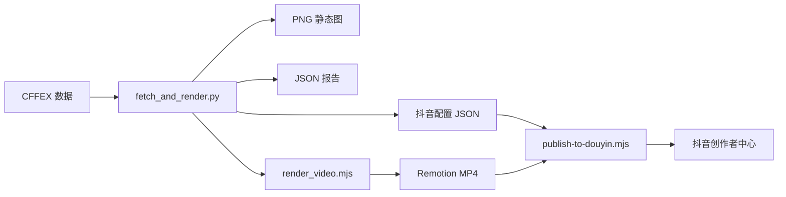

# CFFEX 日报视频完整流程

从中金所（CFFEX）抓取中信期货持仓数据，生成 720×1280 竖屏报告图与动画视频，并自动配置、发布到抖音创作者中心。

---

## 流程概览



| 阶段 | 脚本 | 产物 |
|------|------|------|
| 1. 抓数据 | `fetch_and_render.py` | 报告 JSON |
| 2. 生成静态图 | `fetch_and_render.py` | PNG（Playwright 或 Pillow 降级） |
| 3. 渲染视频 | `render_video.mjs` + Remotion | MP4（约 7.5s，含 BGM） |
| 4. 生成发布配置 | `fetch_and_render.py` | douyin JSON |
| 5. 发布抖音 | `publish-to-douyin.mjs` | 已提交的作品 |

---

## 环境准备

### 系统要求

- macOS（定时任务使用 LaunchAgent）
- Python 3.10+
- Node.js 18+
- Google Chrome（抖音发布脚本依赖）

### 首次安装

在项目根目录执行：

```bash
# Python 依赖
pip3 install Pillow playwright

# Remotion 渲染依赖
cd scripts/cffex-daily/remotion && npm install && cd -

# 抖音发布依赖
npm run cffex:setup-douyin

# 抖音扫码登录（只需一次，登录态持久化）
npm run cffex:auth
```

登录态保存在 `~/.douyin-playwright/profile`，**不要**提交到 git。

---

## 日常使用

### 生成今日视频

```bash
npm run cffex:daily
```

等价于：

```bash
python3 scripts/cffex-daily/fetch_and_render.py
```

### 指定日期 / 周末强制运行

```bash
# 指定交易日
npm run cffex:daily -- --date 20260710

# 周末也运行（默认周末会跳过）
npm run cffex:daily -- --force
```

### 发布到抖音

生成完成后，直接发布最新一条：

```bash
npm run cffex:publish
```

发布指定日期：

```bash
npm run cffex:publish -- --date 20260710
```

发布前调试（填完表单但不点发布）：

```bash
npm run cffex:publish -- --dry-run --keep-open
```

### 一键完整流程

```bash
npm run cffex:daily && npm run cffex:publish
```

---

## 命令参考

| 命令 | 说明 |
|------|------|
| `npm run cffex:daily` | 全流程：数据 + PNG + JSON + MP4 + 抖音配置 |
| `npm run cffex:daily -- --date YYYYMMDD` | 指定交易日 |
| `npm run cffex:daily -- --force` | 周末强制运行 |
| `npm run cffex:video -- --json ... --output ...` | 仅重渲染视频 |
| `npm run cffex:publish` | 发布最新视频到抖音 |
| `npm run cffex:publish -- --date YYYYMMDD` | 发布指定日期视频 |
| `npm run cffex:auth` | 抖音扫码登录 |
| `npm run cffex:setup-douyin` | 安装抖音发布 Playwright 依赖 |
| `npm run cffex:schedule` | 安装每日 22:00 定时任务 |
| `cd scripts/cffex-daily/remotion && npm run preview` | Remotion 本地预览 |

### 发布选项

`npm run cffex:publish` 支持透传以下参数：

| 选项 | 说明 |
|------|------|
| `--dry-run` | 填完表单不发布 |
| `--keep-open` | 完成后不关闭浏览器 |
| `--skip-music` | 跳过选音乐（默认已开启，视频自带 BGM） |
| `--headless` | 无头模式（不推荐，易触发风控） |

---

## 输出文件

默认输出目录：`_cffex/output/`

以 `20260710` 为例：

| 文件 | 说明 |
|------|------|
| `citic-net-positions-20260710.png` | 720×1280 静态报告图 |
| `citic-net-positions-20260710.json` | 报告数据（Remotion props） |
| `citic-net-positions-20260710.mp4` | 竖屏动画视频 |
| `citic-net-positions-20260710-douyin.json` | 抖音发布配置（按日期归档） |
| `douyin-video.json` | 最新一条抖音配置（便于直接发布） |

### 跳过与失败

- **周末**：无 `--force` 时自动跳过，打印 `Skip YYYY-MM-DD: weekend.`
- **非交易日**：CFFEX 返回 404，正常退出
- **视频渲染失败**：stderr 显示 `Video render skipped`，PNG/JSON 仍可用，可单独重跑 `cffex:video`

---

## 配置说明

主配置文件：`scripts/cffex-daily/config.json`

```json
{
  "output_dir": "_cffex/output",
  "theme": "default",
  "chart_width": 632,
  "chart_height": 260,
  "palette": ["#d14d4d", "#3a9a6a", "#b83333", "#257a52", "#4a5568"],
  "logo": "scripts/cffex-daily/logo.png",
  "logo_handle": "@小水獭学AI",
  "bgm": {
    "file": "scripts/cffex-daily/bgm.mp3",
    "volume": 0.14,
    "enabled": true
  },
  "douyin": {
    "tags": ["期货", "股指期货", "中信期货", "持仓数据", "金融"]
  }
}
```

| 字段 | 说明 |
|------|------|
| `output_dir` | 输出目录（相对项目根目录） |
| `logo_handle` | 视频水印账号 |
| `bgm.enabled` | 是否启用背景音乐 |
| `bgm.volume` | BGM 音量（0–1） |
| `chart_width` / `chart_height` | 图表尺寸 |
| `douyin.tags` | 抖音话题标签，最多 5 个 |

其他资源文件：

| 文件 | 说明 |
|------|------|
| `scripts/cffex-daily/bgm.mp3` | 背景音乐（不存在则视频无声） |
| `scripts/cffex-daily/logo.png` | 水印 Logo |
| `scripts/cffex-daily/encouragement_quotes.json` | 每日励志语池 |

---

## 数据与 JSON 结构

### 报告 JSON

`fetch_and_render.py` 输出的数据结构：

```json
{
  "trade_date": "20260710",
  "date_label": "2026年07月10日 周五",
  "daily_quote": "方向对了，不怕路远，坚持就是胜利！",
  "logo_handle": "@小水獭学AI",
  "bgm_enabled": true,
  "bgm_volume": 0.14,
  "citic_by_symbol": { "IH": 163, "IF": -24, "IC": 1510, "IM": -126 },
  "citic_total": 1523,
  "top20_net_short_total": 136619,
  "net_buy_total": 6193
}
```

数据来源：CFFEX 官网持仓排名 CSV（IH / IF / IC / IM 四个品种）。

### 抖音发布 JSON

自动生成，无需手写：

```json
{
  "videoPath": "citic-net-positions-20260710.mp4",
  "title": "20260710中信期货净持仓",
  "description": "2026年07月10日 周五 中信期货净持仓数据\n\nIH +163  IF -24  IC +1510  IM -126\n中信合计净多 +1523\nTop20净空 136619  净买入 6193\n\n方向对了，不怕路远，坚持就是胜利！",
  "tags": ["期货", "股指期货", "中信期货", "持仓数据", "金融"]
}
```

| 字段 | 规则 |
|------|------|
| `videoPath` | 相对 JSON 所在目录的 MP4 路径 |
| `title` | ≤30 字，格式 `{YYYYMMDD}中信期货净持仓` |
| `description` | 日期 + 四品种 + 汇总 + 励志语；不含 `#` 话题 |
| `tags` | 最多 5 个，不带 `#`（发布时脚本自动追加） |

---

## 抖音发布

### 发布流程

`publish-to-douyin.mjs` 调用 `scripts/cffex-daily/douyin/publish-video.mjs`，自动完成：

1. 打开创作者中心视频上传页
2. 上传 MP4
3. 填写标题与描述
4. 选择 AI 推荐封面
5. 添加「内容由 AI 生成」声明
6. 点击发布

默认 `--skip-music`，因为视频已内嵌 BGM。

### 登录

```bash
npm run cffex:auth
```

浏览器打开后，用手机抖音 App 扫码。登录完成后按 Enter 保存。

### 环境变量

| 变量 | 默认值 | 说明 |
|------|--------|------|
| `DOUYIN_PROFILE_DIR` | `~/.douyin-playwright/profile` | Playwright 登录态目录 |
| `DOUYIN_VIDEO_UPLOAD_URL` | 创作者中心上传页 | 覆盖上传入口 URL |

---

## 定时任务

安装 macOS LaunchAgent，每天 **22:00** 自动运行：

```bash
npm run cffex:schedule
```

- Plist 源文件：`scripts/cffex-daily/com.yuque.cffex-daily.plist`
- 安装位置：`~/Library/LaunchAgents/com.yuque.cffex-daily.plist`
- 日志目录：`_cffex/logs/`
- 手动触发：`npm run cffex:daily`

定时任务只生成视频，**不会**自动发布到抖音。

---

## 视频渲染（Remotion）

### 参数

| 项 | 值 |
|----|-----|
| Composition ID | `CiticReportVideo` |
| 尺寸 | 720 × 1280（9:16 竖屏） |
| FPS | 30 |
| 总帧数 | 225（前 45 帧静态 + 180 帧动画） |
| 时长 | 约 7.5 秒 |

### 仅重渲染视频

修改 Remotion 代码或补渲染时：

```bash
npm run cffex:video -- \
  --json _cffex/output/citic-net-positions-20260710.json \
  --output _cffex/output/citic-net-positions-20260710.mp4
```

### 本地预览

```bash
cd scripts/cffex-daily/remotion && npm run preview
```

### 小屏可读性检查（360px）

日报图按 720×1280 设计，发布到抖音后缩略图约 200–360px 宽。建议在每次改 UI 后额外导出一张 360px 宽预览图，确认核心数字与标题仍可读：

```bash
npm run cffex:daily -- --date 20260710 --force
# 可选：用 Playwright 对 .report 截图并缩放至 360px 宽做人工检查
# 核心数字（四品种值、中信整体）应 ≥ 28px 等效；标题距顶/底 ≥ 48px 安全区
```

当前模板已收敛为 5 档字号（26 / 28–30 / 16 / 12 / 10px），section 副标题 ≥ 12px。

### 源码结构

```
scripts/cffex-daily/remotion/src/
├── CiticReportVideo.tsx   # 主画面、动画时序
├── AnimatedBarChart.tsx   # 柱状图动画
├── AnimatedNumber.tsx     # 数字动画
├── constants.ts           # 帧数常量
├── types.ts               # 主题色、数据类型
└── Root.tsx               # Composition 注册
```

---

## 项目目录结构

```
scripts/cffex-daily/
├── fetch_and_render.py       # 主流程：抓数据、渲染图、写 JSON、调视频、写抖音配置
├── render_video.mjs          # 复制 assets → 调用 remotion render
├── publish-to-douyin.mjs     # 抖音发布便捷入口
├── config.json               # 主配置
├── run.sh                    # 定时任务入口
├── install-scheduler.sh      # 安装 LaunchAgent
├── bgm.mp3                   # 背景音乐
├── logo.png                  # 水印
├── encouragement_quotes.json # 励志语池
├── douyin/                   # 抖音发布脚本
│   ├── publish-video.mjs
│   ├── auth.mjs
│   ├── douyin-browser.mjs
│   └── setup.sh
└── remotion/                 # Remotion 视频项目
    └── src/

_cffex/
├── output/                   # 生成的 PNG / JSON / MP4 / 抖音配置
└── logs/                     # 定时任务日志
```

---

## 故障排查

| 现象 | 原因 | 处理 |
|------|------|------|
| `Skip ... weekend` | 周末默认跳过 | 加 `--force` |
| CFFEX 404 / 无数据 | 非交易日 | 换 `--date` 或等下一交易日 |
| Playwright 不可用 | 未安装或启动失败 | 自动降级 Pillow 静态图；视频仍可用 Remotion |
| `Video render skipped` | Remotion 依赖缺失或超时 | `cd scripts/cffex-daily/remotion && npm install`，重跑 `cffex:video` |
| 视频无声音 | BGM 文件缺失或已禁用 | 确认 `bgm.mp3` 存在且 `bgm.enabled: true` |
| 抖音跳转登录页 | 登录态过期 | `npm run cffex:auth` |
| 发布按钮 disabled | 视频未上传完或必填项缺失 | 等待上传完成；检查标题/描述 |
| `Cannot find package 'playwright'` | 抖音脚本依赖未装 | `npm run cffex:setup-douyin` |

---

## 相关资源

- Agent Skill：`.cursor/skills/cffex-daily-video/SKILL.md`（供 Cursor Agent 自动调用）
- 抖音上传页：https://creator.douyin.com/creator-micro/content/upload
- CFFEX 数据：http://www.cffex.com.cn/sj/ccpm/
